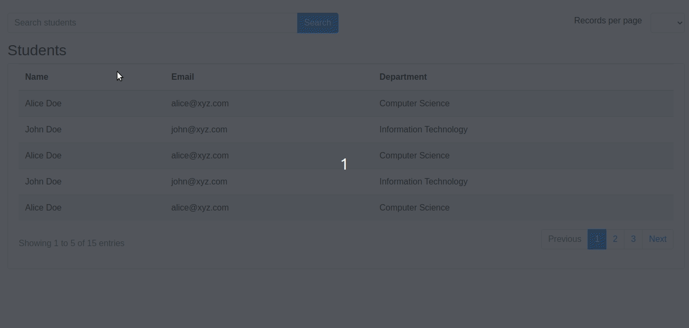

# Server side pagination in angular

This project contains generic and reusable pagination component to achieve server side pagination in angular. The pagination component has been created from scratch and does not use any third party pagination library. 

## Stack used
- Angular
- Typescript
- Node.js
- Bootstrap

## Demo Output

## Outline
- Pagination supportive API
- Reusable pagination component
- Generic pager service for calculating pager data
- Parent component containing table for consuming pagination component

## Share & Care

If you think this project is helpful share it on [Twitter](https://twitter.com/intent/tweet?url=https://github.com/navanathjadhav/pagination-angular)

## Read More
View detailed article on Ever Blogs: [Server-side pagination in Angular 11 | Ever Blogs](https://everblogs.com/angular/server-side-pagination-in-angular-11/)
 
Please visit [Ever Blogs](https://everblogs.com/) to read interesting blogs on other Technologies.

## Development server

Run `ng serve` for a dev server. Navigate to `http://localhost:4200/`. The app will automatically reload if you change any of the source files.

Run `npm run server:start` for a mock Node.js server API. It will start on `http://localhost:4000/`.

## Code scaffolding

Run `ng generate component component-name` to generate a new component. You can also use `ng generate directive|pipe|service|class|guard|interface|enum|module`.

## Build

Run `ng build` to build the project. The build artifacts will be stored in the `dist/` directory. Use the `--prod` flag for a production build.

## Running unit tests

Run `ng test` to execute the unit tests via [Karma](https://karma-runner.github.io).

## Running end-to-end tests

Run `ng e2e` to execute the end-to-end tests via [Protractor](http://www.protractortest.org/).

## Contribute

You are always welcome to help to make this project more knowledgeable and helpful for other developers.

Just submit a PR.
